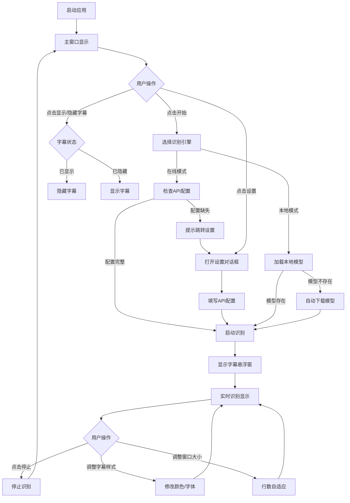

# PRD-AI实时字幕

> 本文档为 AI 实时字幕应用的产品需求文档，面向开发者，描述功能需求与页面内容。

## 1. 修订记录

| 版本 | 日期 | 作者 | 关联文档 | 修改说明 |
|------|------|------|----------|----------|
| V1.0 | 2026-07-27 | 系统 | 全部页面文档 | 初始版本 |

## 2. 需求概述

AI 实时字幕是一款桌面端应用，能够自动识别电脑系统声音（如播放器、浏览器、视频会议等），并将识别结果实时显示为字幕悬浮窗。应用支持本地离线识别和国内在线API识别两种模式，用户可自由切换。

**核心问题**：用户在观看视频、听播客或参加线上会议时，可能遇到声音不清晰或需要静音的场景，实时字幕能帮助用户理解内容。

**业务价值**：
- 无需手动输入，自动识别系统音频
- 支持离线使用，保护隐私
- 字幕窗口可自由调整位置和大小，适应不同使用场景

## 3. 目标用户与使用场景

### 3.1 用户画像

| 用户角色 | 核心诉求 |
|----------|----------|
| 视频观看者 | 在嘈杂环境中观看视频时，通过字幕理解内容 |
| 会议参与者 | 参加线上会议时静音，通过字幕了解讨论内容 |
| 听力障碍者 | 通过字幕获取声音信息 |
| 语言学习者 | 通过字幕学习外语发音和表达 |

### 3.2 典型场景

**场景一：安静观看视频**
- 用户在办公室午休时观看视频，需要静音
- 用户打开应用，点击开始按钮
- 字幕悬浮窗实时显示视频中的对话内容
- 用户可调整字幕窗口位置，避免遮挡视频画面

**场景二：线上会议辅助**
- 用户参加英语线上会议，担心听不懂
- 用户打开应用，选择百度在线识别模式
- 会议过程中实时显示中英文字幕
- 用户可调整字幕字体大小，方便阅读

**场景三：离线学习**
- 用户在通勤途中学习，没有网络
- 用户打开应用，选择本地识别模式
- 播放本地音频文件，实时显示字幕
- 字幕窗口自适应调整行数，充分利用屏幕空间

## 4. 核心用户动线



## 5. 功能清单

```
AI实时字幕
├── 主窗口
│   ├── 引擎状态显示
│   ├── 开始/停止切换
│   ├── 显示/隐藏字幕
│   └── 设置入口
├── 字幕悬浮窗
│   ├── 实时字幕显示
│   ├── 窗口拖动移动
│   ├── 窗口拉伸调整大小
│   ├── 行数自适应窗口高度
│   ├── 文字颜色调整
│   ├── 背景颜色调整
│   ├── 字体大小调整
│   ├── 字幕滚动动画
│   └── 窗口置顶
├── 设置对话框
│   ├── 识别模式选择
│   ├── 识别语言选择
│   ├── 百度API配置
│   ├── 百度API测试
│   ├── 阿里云API配置
│   ├── 阿里云API测试
│   ├── 音频设备选择
│   ├── 分块秒数设置
│   ├── 静音阈值设置
│   └── 本地模型更新
└── 系统托盘
    ├── 显示主窗口
    ├── 显示/隐藏字幕
    └── 退出应用
```

### 5.1 主窗口

**功能描述**：应用的核心控制中心，提供启动/停止识别、显示字幕和打开设置的入口。

#### 5.1.1 引擎状态显示

**功能描述**：实时显示当前使用的识别引擎名称，包括未启动、本地SenseVoice、百度在线、阿里云在线等状态。

#### 5.1.2 开始/停止切换

**功能描述**：通过同一个按钮切换识别状态，点击开始后自动显示字幕悬浮窗。

#### 5.1.3 显示/隐藏字幕

**功能描述**：控制字幕悬浮窗的显示与隐藏状态。

#### 5.1.4 设置入口

**功能描述**：打开设置对话框，配置识别模式、API密钥和音频参数。

### 5.2 字幕悬浮窗

**功能描述**：实时显示识别结果的浮动窗口，支持自由调整位置、大小和样式。

#### 5.2.1 实时字幕显示

**功能描述**：实时显示识别到的文字内容，支持多行显示和自动换行。

#### 5.2.2 窗口拖动移动

**功能描述**：用户可通过鼠标拖动字幕窗口到任意位置。

#### 5.2.3 窗口拉伸调整大小

**功能描述**：用户可通过窗口右下角的尺寸手柄调整窗口大小。

#### 5.2.4 行数自适应窗口高度

**功能描述**：根据窗口高度自动计算可显示的行数，窗口越大显示行数越多。

#### 5.2.5 文字颜色调整

**功能描述**：用户可自由选择字幕文字的颜色。

#### 5.2.6 背景颜色调整

**功能描述**：用户可自由选择字幕背景颜色，支持透明度设置。

#### 5.2.7 字体大小调整

**功能描述**：用户可通过按钮调整字幕字体大小。

#### 5.2.8 字幕滚动动画

**功能描述**：新字幕内容从下方滑入，旧内容上移消失，提供平滑的滚动效果。

#### 5.2.9 窗口置顶

**功能描述**：字幕窗口始终显示在其他窗口之上，确保用户随时可见。

### 5.3 设置对话框

**功能描述**：配置应用各项参数的对话框，包括识别模式、API密钥、音频设置和模型更新。

#### 5.3.1 识别模式选择

**功能描述**：选择识别引擎模式，包括本地、百度在线、阿里云在线和自动模式。

#### 5.3.2 识别语言选择

**功能描述**：选择识别的目标语言，包括中文、英文和自动检测。

#### 5.3.3 百度API配置

**功能描述**：配置百度语音识别的API Key和Secret Key。

#### 5.3.4 百度API测试

**功能描述**：验证百度API配置是否有效，测试连接状态。

#### 5.3.5 阿里云API配置

**功能描述**：配置阿里云语音识别的AccessKey ID、Secret和Appkey。

#### 5.3.6 阿里云API测试

**功能描述**：验证阿里云API配置是否有效，测试连接状态。

#### 5.3.7 音频设备选择

**功能描述**：选择音频输入设备，默认为系统扬声器回采。

#### 5.3.8 分块秒数设置

**功能描述**：设置每次识别的音频片段长度，影响识别延迟和完整性。

#### 5.3.9 静音阈值设置

**功能描述**：设置静音检测的阈值，低于该值的声音视为静音。

#### 5.3.10 本地模型更新

**功能描述**：检查并更新本地SenseVoice模型，确保使用最新版本。

### 5.4 系统托盘

**功能描述**：应用最小化时在系统托盘显示图标，提供快捷操作入口。

#### 5.4.1 显示主窗口

**功能描述**：从托盘菜单中恢复显示主窗口。

#### 5.4.2 显示/隐藏字幕

**功能描述**：从托盘菜单中控制字幕悬浮窗的显示状态。

#### 5.4.3 退出应用

**功能描述**：完全退出应用程序。

## 6. 非功能性需求

| 类别 | 要求 |
|------|------|
| 性能要求 | 识别延迟 < 3秒，字幕显示响应 < 100ms |
| 权限控制 | 无需登录，本地模式无需网络权限 |
| 兼容性 | Windows 10/11，支持64位系统 |
| 数据安全 | API密钥本地存储，不上传第三方服务器 |
| 存储限制 | 本地模型约230MB，配置文件小于1KB |

## 7. 页面清单

| 编号 | 页面名称 | 页面路径 | 对应文档 |
|------|----------|----------|----------|
| 01 | 主窗口 | 应用启动后直接显示 | 01_prd_ai-real-time-subtitle_main-window.md |
| 02 | 设置对话框 | 点击主窗口「设置」按钮 | 02_prd_ai-real-time-subtitle_settings-dialog.md |
| 03 | 字幕悬浮窗 | 点击开始后自动显示，或点击「显示/隐藏字幕」按钮 | 03_prd_ai-real-time-subtitle_subtitle-window.md |
